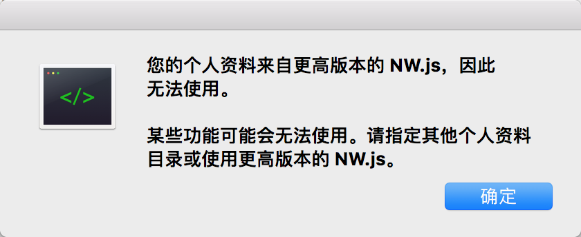
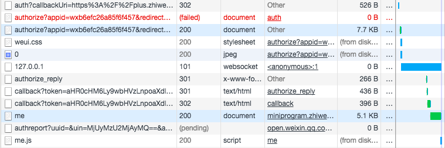
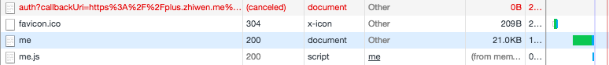

<iframe 
  width="200" 
  height="136" 
  src="http://wxsnsdy.tc.qq.com/105/20210/snsdyvideodownload?filekey=30280201010421301f0201690402534804102ca905ce620b1241b726bc41dcff44e00204012882540400&bizid=1023&hy=SH&fileparam=302c020101042530230204136ffd93020457e3c4ff02024ef202031e8d7f02030f42400204045a320a0201000400"
  frameborder="0" 
  allowfullscreen
/>

微信服务号开发其实就是普通的网站开发，只不过其中可调用微信的 js-sdk 使用基于微信的 api，我们的项目中只是使用了支付、隐藏/显示菜单、自定义分享内容的功能，主要是为了支持小程序不能进行 iOS 支付的问题。由于一部分功能是在小程序中的，就需要小程序与服务号的互相跳转。服务号可通过菜单的定义、长按图片识别二维码跳转到小程序，由于小程序内部只能识别小程序码，不能直接跳转到服务号，只能使用图片+文字引导的方式让用户自己进入服务号。

## 在线工具

[公众平台测试账号](https://mp.weixin.qq.com/debug/cgi-bin/sandbox?t=sandbox/login)

[微信公众平台接口调试工具](https://mp.weixin.qq.com/debug)

[微信 JS 接口签名校验工具](https://mp.weixin.qq.com/debug/cgi-bin/sandbox?t=jsapisign)

## 开发环境

- 扫码登录[公众平台测试账号](https://mp.weixin.qq.com/debug/cgi-bin/sandbox?t=sandbox/login)。
- 接口配置信息，URL 为后端地址，如“http://lichao-server.example/api/weixin”
- JS接口安全域名，前端域名，如“lichao.example”
- 体验接口权限表中，网页服务/网页账号，修改网页授权获取用户基本信息为后端域名，如“lichao-server.example”
- 后端需要 appID、appsecret、Token 进行微信授权、微信支付等操作
- 如果是前后端分离的，后端需要设置跨域
- 如果是前后端分离的，后端需要设置 cookie 在指定域名下的共享

    ```js
    import * as cors from 'cors';
    ...
    // 跨域设置，origin 为前端地址
    app.use(
      cors({
        origin(origin, cb) {
          cb(undefined, server.whitelist.includes(origin));
        },
        credentials: true,
      }),
    );
    // 共享 cookie 设置，server.domain 为前后端都可使用的域名
    app.use(
      session({
        store: new (connectRedis(session))({ client: redis }),
        name: 'sid',
        resave: true,
        saveUninitialized: true,
        secret: server.sessionSecret,
        cookie: { maxAge: 30 * 24 * 60 * 60 * 1000, domain: server.domain },
      }),
    );
    ```

- 前端需要 appID 执行 wx.config 进行 js-sdk 签名

## 真机调试

使用手机微信打开网页就是线上运行的效果，但这样不能使用 localhost 或 127.0.0.1 的地址，需要内网穿透工具进行本地端口映射，然后通过穿透的地址访问，可以使用 [ngrok](https://ngrok.com/)，但是有些慢，还是建议团队搭建完善的开发环境。

可使用[微信开发者工具](https://developers.weixin.qq.com/miniprogram/dev/devtools/download.html)或[微信web开发者工具](https://mp.weixin.qq.com/wiki?t=resource/res_main&id=mp1455784140)进行调试。打开微信web开发者工具可能会报错，一直点确定就打开了。微信web开发者工具可进行移动调试，但需要注意，它在 Network 中显示的请求可能不准确，个人认为是过滤掉了微信内部的请求。以下为授权操作的请求对比。





## 登录授权

参考[微信网页授权](https://mp.weixin.qq.com/wiki?t=resource/res_main&id=mp1421140842)文档，工作主要是在后端，提供一个地址供前端访问，其余工作都由后端完成。后端确保 appID、appsecret、Token 值正确，服务号设置确保接口配置信息、JS接口安全域名、授权回调页面域名正确，即可完成登录授权。前后端都需要注意哪些设置的值是带协议的，哪些是不带协议的，如果服务号设置和后端设置的 appID 等值是正确的，可能是由于多带或少带协议名返回 redirect_uri 错误。我们项目中的 API_SERVER_URL 环境变量如果带了协议名，就会返回这个错误。在微信开发者工具中，授权是跳转到一个登录的页面，在真机上是弹框授权。

因为微信网页授权其实是进行的页面跳转，在项目中如果授权后仍然停留在当前页面，但要发生一些行为，如弹框，只能通过授权后的回调地址带参数的形式。建议授权后的回调地址如果需要传参数，使用 hash 的形式传参，这是因为这个页面如果需要使用 js-sdk，在 iOS 上页面路径发生变化可能会导致 `wx.config()` 执行失败，但 hash 的形式不会有影响。进入页面时在 componentDidMount 中判断 url 是否带有指定的 hash 参数，有则表示是授权后进入的当前页面，执行指定的行为，然后将页面 hash 参数置空。正常情况下授权后进入页面会重新加载整个页面，也就是会执行完整的生命周期方法进入 componentDidMount 中，**但实际中发现有些情况并没有进入 componentDidMount 方法**，因此在 componentDidMount 方法中添加了 hashchange 的监听，在 componentWillUnmount 中取消监听，如果在 componentDidMount 方法中需要网络请求的，也需要注意在授权返回后是否真正发起了该请求以及请求是走的网络还是缓存，可能需要进行特殊处理，就完整的解决了微信网页授权问题。

微信开发者工具中可通过，清缓存 -> 清除开发者工具cookie 取消授权；iOS 真机可通过微信中，我 -> 设置 -> 通用 -> 存储空间 -> 清理微信缓存，取消授权；anroid 真机可通过在微信中，打开网页 debugx5.qq.com，勾上最下面的四项 Cookie、文件缓存、广告过滤缓存、DNS缓存，点击清除取消授权。

示例代码如下：
```js
import queryString from 'query-string';
...
class Page extends React.Component {
  public async componentDidMount() {
    // 判断是否是后端登录返回的
    this.replaceUrl();
    window.addEventListener('hashchange', this.replaceUrl);
  }

  public componentWillUnmount() {
    window.removeEventListener('hashchange', this.replaceUrl);
  }

  public replaceUrl = () => {
    if (window) {
      const parsedHash = queryString.parse(window.location.hash);
      if (parsedHash.show === 'true') {
        window.location.hash = '';
        // 显示 actionSheet
        this.actionSheet.handleShow();
      }
    }
  };

  public showActionSheet = async () => {
    const callbackUri = `${config.clientUrl}/sharePlan#show=true`;
    Router.push(
      `${config.serverUrl}/api/weixin/auth?callbackUri=${callbackUri}`,
    );
  };

  public render() {
    // ...
  }
}
```

## js-sdk 使用

参考[微信JS-SDK说明文档](https://mp.weixin.qq.com/wiki?t=resource/res_main&id=mp1421141115)文档，前端所有需要使用 JS-SDK 的页面必须先执行 `wx.config()` 注入配置信息，前端传入页面 url 给后端，后端返回 timestamp、nonceStr、signature，建议 appId 也一起由后端返回，前端就不需要自己配置 appID 了。

从文档中看注入配置信息没有什么难点，在微信开发者工具、android 真机也非常顺利，但 iOS 真机处了问题，一直提示“invalid signature签名错误”，各种排查问题，后来通过复制页面连接，发现在 iOS 真机单页应用在路由切换时页面 url 一直保持不变，都是第一个打开页面的 url。因此使用了，在项目入口文件，定义一个变量保存页面 url，该变量只被赋值一次，来确保该变量保存的是初次进入页面的 url，然后通过 context 的形式传入到其它页面，在获取 wx.config 的签名参数时，判断如果是 iOS 平台，则传入 context 中的第一个打开页面的 url，否则传入当前页面 url，就解决了签名错误的问题。

还有一个可能遇到的问题，通过服务号进入页面时报签名错误，复制当前网页链接直接进入则签名正确，请检查服务号菜单配置中路径是否正确，可能是路径末尾缺少一个 `/`。程序猿已在风中凌乱。。。

示例代码如下：
```js
// _app.tsx
const ContextType = {
  initialUrl: PropTypes.string,
};
let initialUrl;

class MyApp extends App {
  public static childContextTypes = ContextType;

  public static async getInitialProps({ Component, ctx }) {
    let pageProps = {};

    if (Component.getInitialProps) {
      pageProps = await Component.getInitialProps(ctx);
    }

    return { pageProps, query: ctx.query, asPath: ctx.asPath };
  }

  public getChildContext() {
    return {
      initialUrl,
    };
  }
  ...
}

// 使用组件
try {
  // 1.获取签名需要的页面 url
  let signUrl = `${config.clientUrl}${Router.asPath}`;
  // 1.1判断 ios 终端
  const userAgent = navigator.userAgent;
  const isiOS = !!userAgent.match(/\(i[^;]+;( U;)? CPU.+Mac OS X/);
  if (isiOS) {
    signUrl = `${config.clientUrl}${this.context.initialUrl}`;
  }
  // 2.调用后台接口获取签名需要的参数
  const signSdkData: SignSdkData = await this.context.client.query({
    fetchPolicy: 'network-only',
    query: signSdkQuery,
    variables: {
      uri: signUrl,
    },
  });
  // 3.进行 js-sdk 签名
  if (signSdkData && signSdkData.data && signSdkData.data.signSdk) {
    const { appId, nonceStr, signature, timestamp } = signSdkData.data.signSdk;
    wx.config({
      appId,
      debug: true,
      jsApiList: [
        'onMenuShareAppMessage',
        'onMenuShareTimeline',
        'hideMenuItems',
        'showMenuItems',
      ],
      nonceStr,
      signature,
      timestamp,
    });
    // 4.签名成功执行回调
    wx.ready(() => {
      this.props.callback();
    });
  }
} catch (error) {
  console.log(error);
}
```

## 生产环境

- 注册服务号，进行微信认证
- 开发者工具 -> web开发者工具， 添加开发者账号，才可开发该 appID 的服务号
- 设置 -> 人员设置，添加运行人员，可登录后台和群发消息
- 功能 -> 自定义菜单，配置菜单
- 小程序 -> 小程序管理，添加关联的小程序
- 小程序 -> 展示场景，在公众号资料中展示小程序
- 设置 -> 公众号设置 -> 功能设置，JS接口安全域名为前端域名，网页授权域名为后端域名，业务域名好像没用【待确定】
- 开发 -> 基本配置，IP白名单中添加后端 IP，服务器配置未启用【待确定】
- 微信商户平台 -> 产品中心 -> 开发配置，设置H5支付的授权目录，注意是目录，以`/`结尾，如 `http://example.com/pages/`
